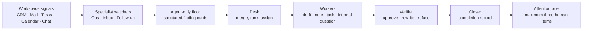

# The Floor — small-org orchestration

> **Status:** This is the intended next architecture. The recorded MVP implements watchers, Desk, a closed action set, and the brief. Verifier, Closer, Router, and the reply handler are deliberately not claimed as live demo behaviour.

## The contract between agents

Each handoff is narrow and inspectable:

1. Watchers post findings with account, evidence, cause, and a proposed action.
2. The Desk merges related findings into one problem and assigns only closed-set actions.
3. Workers prepare the safe action; they do not send messages or alter stages or calendars.
4. Verifier checks the exact action against the evidence and safety rules.
5. Closer turns approved receipts into a concise status for the Desk.
6. The Desk sends humans one ranked brief, with no more than three decisions.

## Designed, not demoed

- **Router:** eventually routes new workspace events to the correct specialist; the demo runs a scheduled sweep instead.
- **Reply handler:** eventually records explicit human decisions from the attention thread; the demo leaves this as the next rung.

The target remains bounded: one sweep, one merge pass, approved safe work, and one human brief.
