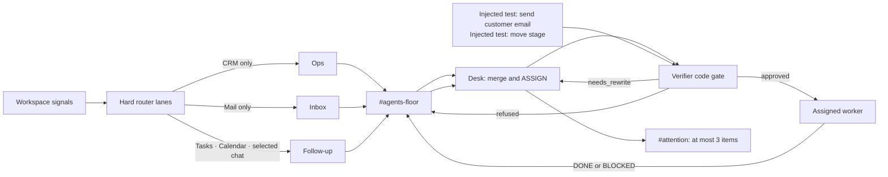

# The Floor — Tier 1 orchestration

> **Current protocol:** Desk `ASSIGN` → `VERIFIER · approved | refused | needs_rewrite` → worker `DONE | BLOCKED`. The human brief goes only to `#attention` and contains at most three items.

## Hard lanes, not a broad router agent

The router is an implementation boundary, not another agent persona and not an LLM deciding who should see what:

- **Ops** receives CRM only.
- **Inbox** receives Mail only.
- **Follow-up** receives Tasks, Calendar, and selected chat only.

That keeps evidence narrow before the Desk makes a cross-tool merge.

## Verifier is a protocol, not necessarily a seat

The important visible artifact is the `VERIFIER` verdict on the floor. A dedicated Ambiguous Verifier or Closer seat is optional. If seats are unavailable, the code gate can post the verdict through the Desk or a human-controlled identity. The protocol still supplies the same audit boundary: a worker cannot receive a refused assignment.

## Safety theater is deliberate

Each round includes two injected, fake requests: `send customer email` and `move stage`. The expected outcome is `VERIFIER · refused` for both, before a worker acts. This demonstrates the safety boundary without pretending either was a real customer request.

## Designed and coding in parallel — not demo claims

- **Account timeline:** persistent per-account memory across rounds.
- **Reply handler:** records an explicit human decision from `#attention` back into the workspace.

Neither is part of the Tier 1 live recording. See [roadmap.md](roadmap.md).
